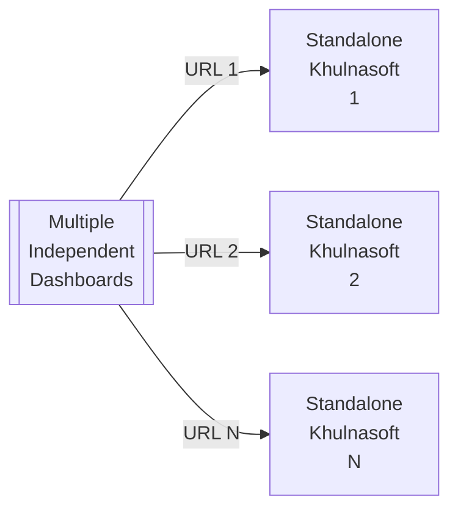
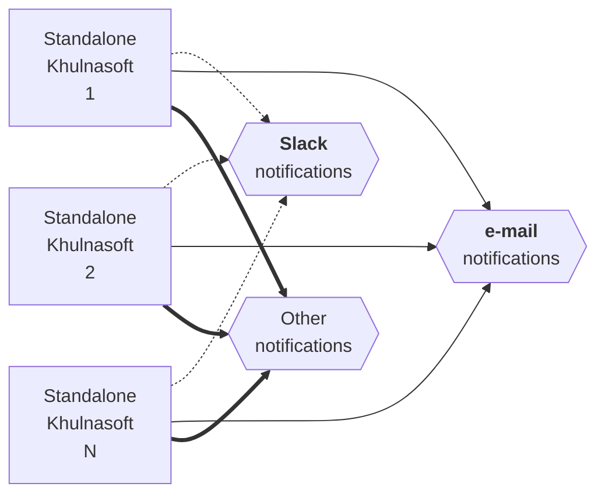
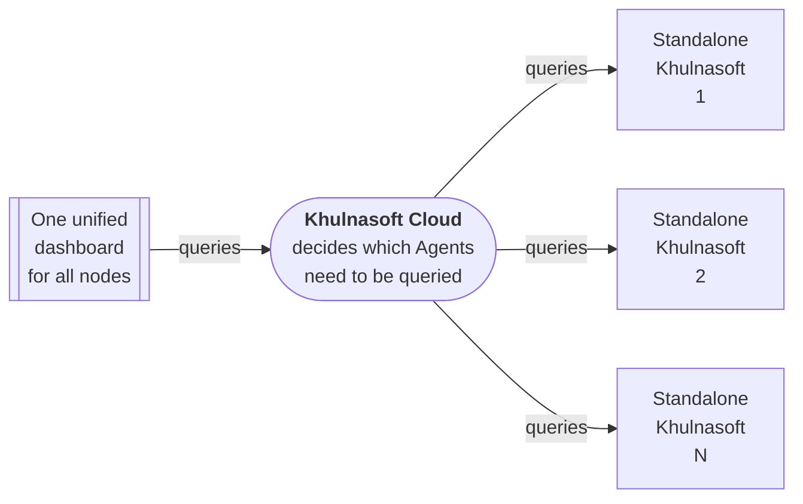
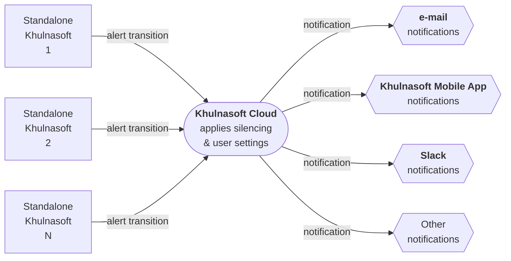

# Standalone Deployment

To help our users have a complete experience of Khulnasoft when they install it for the first time, the Khulnasoft Agent with default configuration is a complete monitoring solution out of the box, with features enabled and available.

So, each Khulnasoft Agent acts as a standalone monitoring system by default.

## Standalone Agents, without Khulnasoft Cloud

|                    Feature                    |                     How it works                     |
|:---------------------------------------------:|:----------------------------------------------------:|
| Unified infrastructure dashboards for metrics |  No, each Khulnasoft Agent provides its own dashboard   |
|  Unified infrastructure dashboards for logs   |     No, each Khulnasoft Agent exposes its own logs      |
|          Centrally configured alerts          |  No, each Khulnasoft has its own alerts configuration   |
|   Centrally dispatched alert notifications    | No, each Khulnasoft Agent sends notifications by itself |
|         Data are exclusively on-prem          |                         Yes                          |

When using Standalone Khulnasoft Agents, each of them offers an API and a dashboard, at its own unique URL, that looks like `http://agent-ip:19999`.

So, each of the Khulnasoft Agents has to be accessed individually and independently of the others:

The same is true for alert notifications. Each of the Khulnasoft Agents runs its own alerts and sends notifications by itself, according to its configuration:

### Configuration steps for standalone Khulnasoft Agents without Khulnasoft Cloud

No special configuration needed.

- Install Khulnasoft Agents on all your systems, then access each of them via its own unique URL, that looks like `http://agent-ip:19999/`.

## Standalone Agents, with Khulnasoft Cloud

|                    Feature                    |                                                                              How it works                                                                               |
|:---------------------------------------------:|:-----------------------------------------------------------------------------------------------------------------------------------------------------------------------:|
| Unified infrastructure dashboards for metrics |                                                 Yes, via Khulnasoft Cloud, all charts aggregate metrics from all servers.                                                  |
|  Unified infrastructure dashboards for logs   | All logs are accessible via the same dashboard at Khulnasoft Cloud, although they are not unified (ie. logs from different servers are not multiplexed into a single view) |
|          Centrally configured alerts          |                                                            No, each Khulnasoft has its own alerts configuration                                                            |
|   Centrally dispatched alert notifications    |                                                                         Yes, via Khulnasoft Cloud                                                                          |
|         Data are exclusively on-prem          |                                                 Yes, Khulnasoft Cloud queries Khulnasoft Agents to satisfy dashboard queries.                                                 |

By [connecting all Khulnasoft Agents to Khulnasoft Cloud](/docs/khulnasoft-cloud/connect-agent-to-cloud), you can have a unified infrastructure view of all your nodes, with aggregated charts, without configuring [observability centralization points](/docs/observability-centralization-points).

Similarly for alerts, Khulnasoft Cloud receives all alert transitions from all Agents, decides which notifications should be sent and how, applies silencing rules, maintenance windows and based on each Khulnasoft Cloud space and user settings, dispatches notifications:

> **Note**
>
> Alerts are still triggered by Khulnasoft Agents. Khulnasoft Cloud only takes care of the notifications.

### Configuration steps for standalone Khulnasoft Agents with Khulnasoft Cloud

- Install Khulnasoft Agents using the commands given by Khulnasoft Cloud so that they will be automatically connected to your Space. Otherwise, install Khulnasoft Agents and connect them via the command line or their dashboard.

- Optionally: disable their direct dashboard access to secure them.

- Optionally: disable their alert notifications to avoid receiving email notifications directly from them (email notifications are automatically enabled when a working MTA is found on the systems Khulnasoft Agents are installed).
