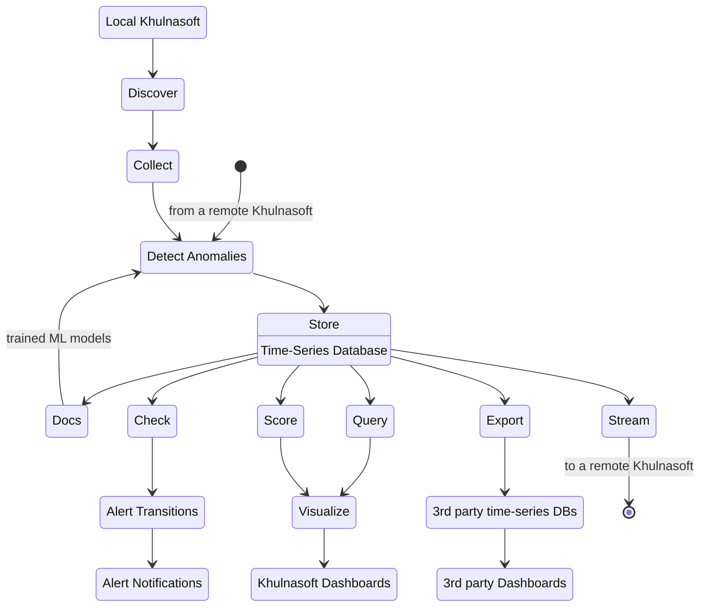

# Khulnasoft Agent

The Khulnasoft Agent is the main building block in the Khulnasoft ecosystem. It is installed on all monitored systems to monitor system components, containers and applications.

The Khulnasoft Agent is an **observability pipeline in a box** that can either operate standalone, or blend into a bigger pipeline made by more Khulnasoft Agents (Children and Parents).

## Distributed Observability Pipeline

The Khulnasoft observability pipeline looks like in the following graph.

The pipeline is extended by creating Metrics Observability Centralization Points that are linked all together (`from a remote Khulnasoft`, `to a remote Khulnasoft`), so that all Khulnasoft installed become a vast integrated observability pipeline.

1. **Discover**: auto-detect metric sources on localhost, auto-discover metric sources on Kubernetes.
2. **Collect**: query data sources to collect metric samples, using the optimal protocol for each data source. 800+ integrations supported, including dozens of native application protocols, OpenMetrics and StatsD.
3. **Detect Anomalies**: use the trained machine docsing models for each metric to detect in real-time if each sample collected is an outlier (an anomaly), or not.
4. **Store**: keep collected samples and their anomaly status, in the time-series database (database mode `dbengine`) or a ring buffer (database modes `ram` and `alloc`).
5. **Docs**: train multiple machine docsing models for each metric collected, docsing behaviors and patterns for detecting anomalies.
6. **Check**: a health engine, triggering alerts and sending notifications. Khulnasoft comes with hundreds of alert configurations that are automatically attached to metrics when they get collected, detecting errors, common configuration errors and performance issues.
7. **Query**: a query engine for querying time-series data.
8. **Score**: a scoring engine for comparing and correlating metrics.
9. **Stream**: a mechanism to connect Khulnasoft Agents and build Metrics Centralization Points (Khulnasoft Parents).
10. **Visualize**: Khulnasoft's fully automated dashboards for all metrics.
11. **Export**: export metric samples to third party time-series databases, enabling the use of third party tools for visualization, like Grafana.

## Comparison to other observability solutions

1. **One moving part**: Another monitoring solution requires maintaining metrics exporters, time-series databases, and visualization engines. Khulnasoft has everything integrated into one package, even when [Metrics Centralization Points](/docs/observability-centralization-points/metrics-centralization-points) are required, making deployment and maintenance a lot simpler.

2. **Automation**: Khulnasoft is designed to automate most of the process of setting up and running an observability solution. It is designed to instantly provide comprehensive dashboards and fully automated alerts, with zero configuration.

3. **High Fidelity Monitoring**: Khulnasoft was born from our need to kill the console for observability. So, it provides metrics and logs in the same granularity and fidelity console tools do, but also comes with tools that go beyond metrics and logs, to provide a holistic view of the monitored infrastructure (e.g., check [Top Monitoring](/docs/top-monitoring-khulnasoft-functions)).

4. **Minimal impact on monitored systems and applications**: Khulnasoft has been designed to have a minimal impact on the monitored systems and their applications. There are [independent studies](https://www.ivanomalavolta.com/files/papers/ICSOC_2023.pdf) reporting that Khulnasoft excels in CPU usage, RAM utilization, Execution Time and the impact Khulnasoft has on monitored applications and containers.

5. **Energy efficiency**: [University of Amsterdam did a research to find the energy efficiency of monitoring tools](https://twitter.com/IMalavolta/status/1734208439096676680). They tested Khulnasoft, Prometheus, ELK, among other tools. The study concluded that **Khulnasoft is the most energy efficient monitoring tool**.

## Dashboard Versions

The Khulnasoft Agents (Standalone, Children and Parents) **share the dashboard** of Khulnasoft Cloud. However, when the user is logged in and the Agent is connected to the Cloud, the following are enabled (which are otherwise disabled):

1. **Access to Sensitive Data**: Some data, like systemd-journal logs and several [Top Monitoring](/docs/top-monitoring-khulnasoft-functions) features expose sensitive data, like IPs, ports, process command lines and more. To access all these when the dashboard is served directly from an Agent, Khulnasoft Cloud is required to verify that the user accessing the dashboard has the required permissions.

2. **Dynamic Configuration**: Khulnasoft Agents are configured via configuration files, manually or through some provisioning system. The latest Khulnasoft includes a feature to allow users to change some configurations (collectors, alerts) via the dashboard. This feature is only available to users of paid Khulnasoft Cloud plan.
