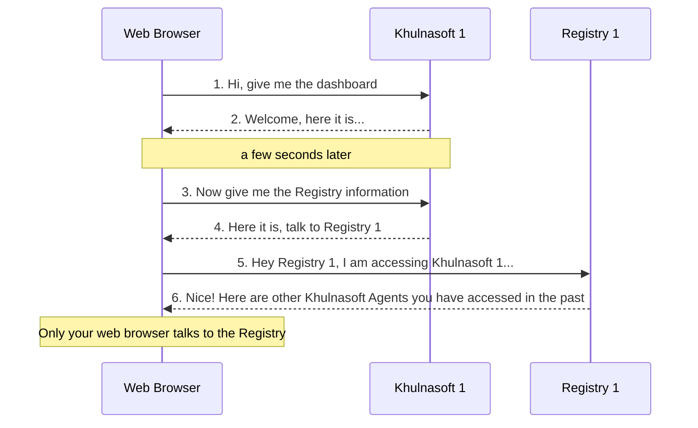

# Registry

Khulnasoft uses a **central Registry**. Together with certain browser features, it allows for unified cross-Agent dashboards. For example, when you jump from Agent to Agent using the node menu, several session settings (like the currently viewed charts, the current zoom and pan operations on the charts, etc.) are propagated to the new Agent, so that the new dashboard will come with exactly the same view.

## Default Registry

The default Registry is `https://registry.my-khulnasoft.io`, which is currently served by `https://london.my-khulnasoft.io`. This Registry listens to both HTTP and HTTPS requests with the default being HTTPS.

## What data is stored

The Registry keeps track of four entities:

1. **machines**: The Khulnasoft installations (a random GUID generated by each Khulnasoft the first time it starts, we call this **machine_guid**)

   For each Khulnasoft installation, the Registry keeps track of the various different URLs it has accessed.

2. **people**: The web browsers accessing the Khulnasoft installations (a random GUID generated by the Registry the first time it sees a new web browser, we call this **person_guid**)

   For each person, the Registry keeps track of the Khulnasoft installations it has accessed and their URLs.

3. **URLs** of Khulnasoft installations (as seen by the web browsers)

   For each URL, the Registry keeps the URL and nothing more. Each URL is linked to **people** and **machines**. The only way to find a URL is to know its **machine_guid** or have a **person_guid** that is linked to it.

4. **accounts**: The information used to sign in via one of the available sign-in methods. Depending on the method, this may include only an email or additionally a profile picture or avatar.

For **people**, **accounts** and **machines**, the Registry keeps links to **URLs**, each link with two timestamps (first time seen, last time seen) and a counter (number of times it has been seen).

**machines**, **people** and timestamps are stored in the Khulnasoft Registry regardless of whether you sign in or not.

## Communication with the Registry

**Only** your web browser communicates with the Registry. If sending this information is against your policies, you can [run your own Registry](/docs/khulnasoft-agent/configuration/registry)

Your Agents do not talk to the Registry. This is a diagram explaining the process:

