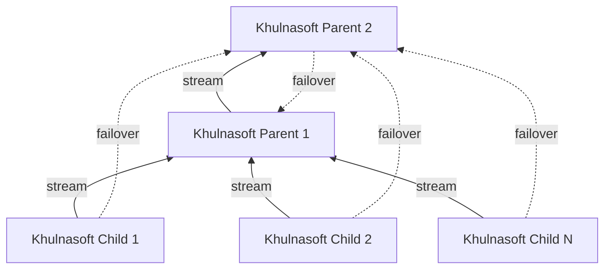

# Clustering and High Availability of Khulnasoft Parents

Khulnasoft supports building Parent clusters of 2+ nodes. Clustering and high availability work like this:

1. All Khulnasoft Children are configured to stream to all Khulnasoft Parents. The first one found working will be used by each Khulnasoft Child, and the others will be automatically used if and when this connection is interrupted.
2. The Khulnasoft Parents are configured to stream to all other Khulnasoft Parents. For each of them, the first-found working will be used and the others will be automatically used if and when this connection is interrupted.

All the Khulnasoft Parents in such a cluster will receive all the metrics of all Khulnasoft Children connected to any of them. They will also receive the metrics all the other Khulnasoft Parents have.

If a Parent node fails, its Child nodes automatically connect to another available Parent node, which then re-streams metrics to all other Parent nodes.

Khulnasoft Cloud will receive registrations for all Khulnasoft Children from all the Khulnasoft Parents. As long as at least one of the Khulnasoft Parents is connected to Khulnasoft Cloud, all the Khulnasoft Children will be available on Khulnasoft Cloud.

Khulnasoft Children need to maintain retention only for the time required to switch Khulnasoft Parents. When Khulnasoft Children connect to a Khulnasoft Parent, they negotiate the available retention and any missing data on the Khulnasoft Parent are replicated from the Khulnasoft Children.

## Restoring a Khulnasoft Parent after maintenance

Given the [replication limitations](/docs/observability-centralization-points/metrics-centralization-points/replication-of-past-samples#replication-limitations), special care is needed when restoring a Khulnasoft Parent after some long maintenance work on it.

If the Khulnasoft Children do not have enough retention to replicate the missing data on this Khulnasoft Parent, it is preferable to block access to this Khulnasoft Parent from the Khulnasoft Children, until it replicates the missing data from the other Khulnasoft Parents.

To block access from Khulnasoft Children, and still allow access from other Khulnasoft Parent siblings:

1. Use `iptables` to block access to port 19999 from Khulnasoft Children to the restored Khulnasoft Parent, or
2. Use separate streaming API keys (in `stream.conf`) for Khulnasoft Children and Khulnasoft Parents, and disable the API key used by Khulnasoft Children, until the restored Khulnasoft Parent has been synchronized.

## Duplicating a Parent

The easiest way is to `rsync` the directory `/var/cache/khulnasoft` from the existing Khulnasoft Parent to the new Khulnasoft Parent.

> Important: Starting the new Khulnasoft Parent with default settings, may delete the new files in `/var/cache/khulnasoft` to apply the default disk size constraints. Therefore, it is important to set the right retention settings in the new Khulnasoft Parent before starting it up with the copied files.

To configure retention at the new Khulnasoft Parent, set in `khulnasoft.conf` the following to at least the values the old Khulnasoft Parent has:

- `[db].dbengine tier 0 retention size`, this is the max disk size for `tier0`. The default is 1GiB.
- `[db].dbengine tier 1 retention size`, this is the max disk space for `tier1`. The default is 1GiB.
- `[db].dbengine tier 2 retention size`, this is the max disk space for `tier2`. The default is 1GiB.
